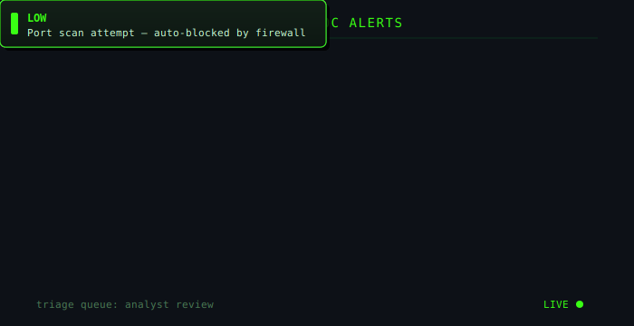

<!-- Header Banner - Cyber Blue Theme -->

 

  

 

 

## <b>About Me</b>

<table width="100%">
<tr>
<td width="65%" valign="top">

I'm **J. Bharathikumar**, a Cyber Security student at Mahalingam College of Engineering and Technology, working step by step toward a career as a **SOC (Security Operations Center) Analyst**.

My focus sits firmly on the **blue-team** side of security. I'm drawn to the investigative side of the field — **threat detection**, **incident response**, and **proactive threat hunting** — the work that happens in a real SOC.

I learn by **building, not just reading**. Rather than only working through courses, I design and build interactive SOC labs, realistic investigation scenarios, and browser-based tools that simulate what analysts actually do.

Alongside that, I'm developing a free, structured **SOC Analyst Roadmap** — a step-by-step path covering networking and OS fundamentals, SIEM tools, detection engineering, and MITRE ATT&CK — aimed at helping newcomers enter the field with confidence.

My long-term goal is to become the analyst who catches what automated tools miss: someone who understands attacker behavior deeply enough to detect it early, respond calmly under pressure, and keep systems (and people) safe.

</td>
<td width="35%" valign="top">

| | |
|---|---|
| **Target Role** | SOC Analyst |
| **Track** | Blue Team |
| **Focus Areas** | Detection, IR, Hunting |
| **Location** | Tamil Nadu, IN |
| **Status** | Open to opportunities |

</td>
</tr>
</table>

## <b>Education</b>

<table width="100%">
<tr>
<td width="8%" align="center" valign="top">

🏛️

</td>
<td width="92%" valign="top">

**Bachelor of Engineering (B.E.) — Cyber Security**
 
 Dr.Mahalingam College of Engineerin and Technology (MCET), Pollachi
 

</td>
</tr>
<tr><td colspan="2"> </td></tr>
<tr>
<td width="8%" align="center" valign="top">

📜

</td>
<td width="92%" valign="top">

**Diploma — Communication and Computer Networking**
 
Nachimuthu Polytechnic College, Pollachi
 

</td>
</tr>
</table>

## <b>Tools & Technologies</b>

  

 

## <b>Live SOC Alerts Feed</b>

## <b>Projects</b>

<table width="100%">
<tr>
<td width="50%" valign="top">

### <b>Interactive SOC Labs</b>

Browser-based labs simulating real investigations — Windows Event Log analysis, phishing, malware/ransomware cases, network intrusion, and MITRE ATT&CK mapping.

`Windows Event Logs` `MITRE ATT&CK` `Incident Response`

</td>
<td width="50%" valign="top">

### <b>SOC Analyst Roadmap</b>

A free, structured learning path from networking and OS fundamentals through SIEM tools, detection, and MITRE ATT&CK — built for beginners entering SOC work.

`Splunk` `Sentinel` `Wazuh` `Elastic`

</td>
</tr>
<tr>
<td width="50%" valign="top">

### <b>SOC LEARING PLATFORM CLONE OF TRYHACKME VERSION WITH FREE </b>

Interactive platform delivering realistic SOC investigations with AI-assisted guidance and practical exercises for SOC learners.

`AI-assisted` `Simulation` `Web App`

</td>
<td width="50%" valign="top">

### <b>Trusted Third Party Cloud Storage</b>

Diploma capstone — a secure cloud storage system on a Trusted Third Party model, covering authentication, file sharing, and data integrity.

`HTML` `CSS` `JavaScript` `Networking`

</td>
</tr>
</table>

## <b>Currently Learning</b>

## <b>Career Objective</b>

 

### Let's Connect

 

Learn - Build - Detect - Defend - Repeat

