<!-- Header Banner - New Theme: Matrix Green -->

 

<!-- Animated defensive security / threat detection radar -->

 

  

 

 

## About Me

<table width="100%">
<tr>
<td width="65%" valign="top">

I'm **J. Bharathikumar**, a Cyber Security student at Mahalingam College of Engineering and Technology, working step by step toward a career as a **SOC (Security Operations Center) Analyst**.

My focus sits firmly on the **blue-team** side of security. I'm drawn to the investigative side of the field — **threat detection**, **incident response**, and **proactive threat hunting** — the work of spotting the signal inside the noise, tracing an attacker's footprint through logs, and responding fast enough that it never becomes a headline.

I learn by **building, not just reading**. Rather than only working through courses, I design and build interactive SOC labs, realistic investigation scenarios, and browser-based tools that simulate what an analyst actually sees on the job — Windows Event Logs, alert triage, phishing artifacts, and MITRE ATT&CK-mapped intrusions.

Alongside that, I'm developing a free, structured **SOC Analyst Roadmap** — a step-by-step path covering networking and OS fundamentals, SIEM tools, detection engineering, and MITRE ATT&CK — aimed at helping other beginners break into SOC work without getting lost in scattered resources.

My long-term goal is to become the analyst who catches what automated tools miss: someone who understands attacker behavior deeply enough to detect it early, respond calmly under pressure, and keep improving the detection stack over time.

</td>
<td width="35%" valign="top">

| | |
|---|---|
| **Target Role** | SOC Analyst |
| **Track** | Blue Team |
| **Focus Areas** | Detection, IR, Hunting |
| **Location** | Tamil Nadu, IN |
| **Status** | Open to opportunities |

</td>
</tr>
</table>

## Education

<table width="100%">
<tr>
<td width="8%" align="center" valign="top">

🏛️

</td>
<td width="92%" valign="top">

**Bachelor of Engineering (B.E.) — Cyber Security**
 
Mahalingam College of Engineering and Technology (MCET), Pollachi
 

</td>
</tr>
<tr><td colspan="2"> </td></tr>
<tr>
<td width="8%" align="center" valign="top">

📜

</td>
<td width="92%" valign="top">

**Diploma — Communication and Computer Networking**
 
Nachimuthu Polytechnic College, Pollachi
 

</td>
</tr>
</table>

## Tools & Technologies

  

## Projects

<table width="100%">
<tr>
<td width="50%" valign="top">

### Interactive SOC Labs

Browser-based labs simulating real investigations — Windows Event Log analysis, phishing, malware/ransomware cases, network intrusion, and MITRE ATT&CK mapping.

`Windows Event Logs` `MITRE ATT&CK` `Incident Response`

</td>
<td width="50%" valign="top">

### SOC Analyst Roadmap

A free, structured learning path from networking and OS fundamentals through SIEM tools, detection, and MITRE ATT&CK — built for beginners entering SOC work.

`Splunk` `Sentinel` `Wazuh` `Elastic`

</td>
</tr>
<tr>
<td width="50%" valign="top">

### AI-Powered SOC Learning Platform

Interactive platform delivering realistic SOC investigations with AI-assisted guidance and practical exercises for SOC learners.

`AI-assisted` `Simulation` `Web App`

</td>
<td width="50%" valign="top">

### Trusted Third Party Cloud Storage

Diploma capstone — a secure cloud storage system on a Trusted Third Party model, covering authentication, file sharing, and data integrity.

`HTML` `CSS` `JavaScript` `Networking`

</td>
</tr>
</table>

## Currently Learning

## Career Objective

 

### Let's Connect

 

Learn - Build - Detect - Defend - Repeat

